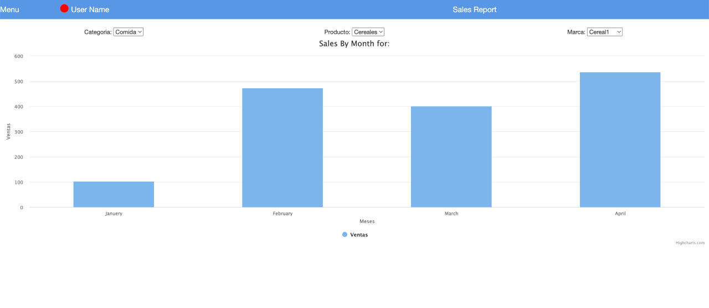

This is a [Next.js](https://nextjs.org/) project bootstrapped with [`create-next-app`](https://github.com/vercel/next.js/tree/canary/packages/create-next-app).
Uses [TailwindCSS](https://tailwindcss.com/) and [ChartJS](https://www.chartjs.org/).

## Getting Started

First, run the development server:

```bash
npm run dev
# or
yarn dev
# or
pnpm dev
```

## Test instructions (Verbatim):

<p align="center">
  
</p>

El objetivo del ejercicio es montar una pantalla con HTML5 CSS3 y JS que simule el funcionamiento presentado en reunión. 

3 selects de categorías actualizados en cascada que generan un resultado diferente en pantalla tras actualización de usuario, desde el select 3, presentar un numero de ventas en el mes para esta tercera categoría.

Los selects 1 y 2 deben al menos contener 3 categorías cada uno.